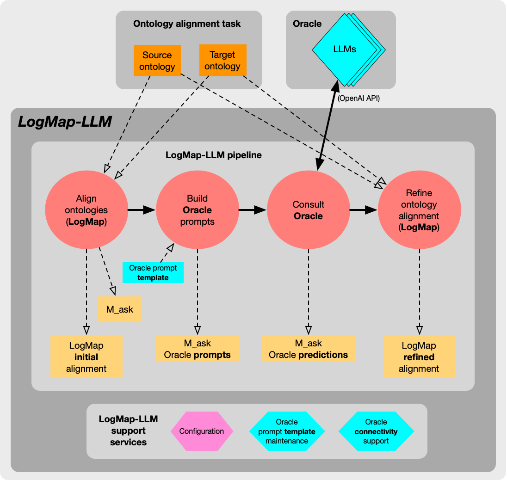
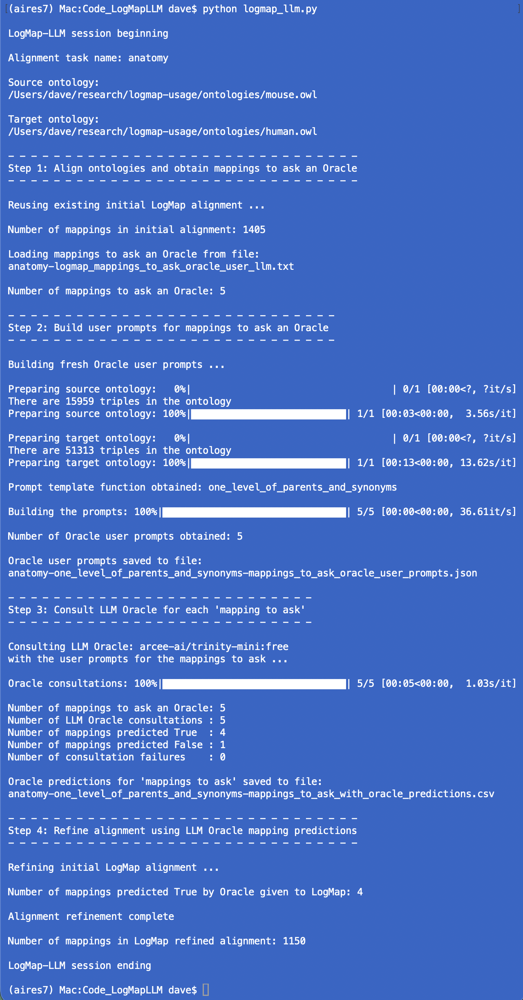

## LogMapLLM
Large Language Models as Oracles for Ontology Alignment with LogMap (work in progress).

There are many methods and systems to tackle the ontology alignment problem, yet a major challenge persists in producing high-quality mappings among a set of input ontologies. Adopting a human-in-the-loop approach during the alignment process has become essential in applications requiring very accurate mappings. However, user involvement is expensive when dealing with large ontologies. In this work, we evaluate the feasibility of using Large Language Models (LLM) to aid the ontology alignment problem. The use of LLMs is focused only on the validation of a subset of correspondences where an ontology alignment system (e.g., LogMap) is very uncertain. We have conducted an extensive analysis over several tasks of the Ontology Alignment Evaluation Initiative (OAEI), eveluating the performance of several state-of-the-art LLMs using different ontology-driven prompt templates. In the [OAEI 2025 Bio-ML track](https://liseda-lab.github.io/OAEI-Bio-ML/2025/index.html#results), LogMap with an LLM-based Oracle has achieved the top-2 overall results. LLM efficacy is also assessed against simulated Oracles with varying error rates.

Current efforts are focusing on the creation of an integrated LogMapLLM pipeline (this repository).

### LogMap-LLM conceptual architecture

In the architecture diagram, references to `M_ask` refer to the **mappings to ask** an Oracle. These are mappings considered during the LogMap alignment of which LogMap is particularly uncertain, and for which it invites feedback (opinions) from an external Oracle of some kind. In the case of LogMap-LLM, the Oracle is an LLM rather than a human domain expert.  For each candidate mapping (pair of entities) in the set `M_ask`, LogMap-LLM builds a unique Oracle (LLM) **user** prompt to put to an LLM. The predictions of the LLM Oracle for `M_ask` are then fed into LogMap so that it can refine its initial alignment, by taking the predictions of the LLM Oracle for the candidate mappings in `M_ask` into account.

### LogMap-LLM user experience example 1

The following figure shows a snapshot of a LogMap-LLM session when LogMap-LLM is used from the command-line. In this use case, the hypothetical user is using LogMap-LLM in order to use LogMap by itself, without involving LLM Oracles. This use case best supports exploratory ontology alignment, where the user wants to use LogMap alone, but prefers a Pythonic way of interacting with LogMap (a Java application).

The LogMap-LLM basic configuration file, `logmap-llm-config-basic.toml`, allows the user to configure the LogMap-LLM pipeline (depicted in the conceptual architecture diagram) for the use case demonstrated in this console snapshot.  In `logmap-llm-config-basic.toml`, this pipeline configuration is called **use case A**.

### LogMap-LLM user experience example 2

The following figure shows a snapshot of a LogMap-LLM session when LogMap-LLM is used from the command-line to consult with an LLM Oracle. In this use case, the hypothetical user is reusing an existing intial LogMap alignment, but now is consulting an LLM Oracle for predictions with respect to `M_ask` --- the set of mappings to ask an Oracle.  By taking the feedback from the Oracle with respect to `M_ask` into account, LogMap is able to refine its alignment for the given alignment task.

The LogMap-LLM basic configuration file, `logmap-llm-config-basic.toml`, the pipeline configuration for this use case is called **use case C**.

### Additional repositories

- LogMap Ontology Alignment System: [https://github.com/ernestojimenezruiz/logmap-matcher](https://github.com/ernestojimenezruiz/logmap-matcher)
- Experiments with different LLMs (and prompts) as diagnostic tools (e.g., Oracles): [https://github.com/city-artificial-intelligence/rai-ukraine-kga-llm](https://github.com/city-artificial-intelligence/rai-ukraine-kga-llm)
 

### References

- Sviatoslav Lushnei, Dmytro Shumskyi, Severyn Shykula, Ernesto Jiménez-Ruiz, and Artur Garcez. **Large Language Models as Oracles for Ontology Alignment**. [arXiv](https://ernestojimenezruiz.github.io/assets/pdf/llm-oa-oracles-2025.pdf). Accepted to [EACL 2026](https://2026.eacl.org/) (main conference).
- Ernesto Jiménez-Ruiz, Sviatoslav Lushnei, Dmytro Shumskyi, Severyn Shykula, and Artur Garcez. **LogMap Family welcomes LogMapLLM in the OAEI 2025**. OM 2025: The 20th International Workshop on Ontology Matching collocated with the 24th International Semantic Web Conference (ISWC). 2025. [[PDF](https://ceur-ws.org/Vol-4144/om2025-oaei-paper7.pdf)]

### Acknowledgements

This work has been partially funded by the [RAI for Ukraine program](https://airesponsibly.net/RAIforUkraine/) (NYU Center for Responsible AI) and by The Turing project [GUARD](https://ernestojimenezruiz.github.io/projects/guard/).
